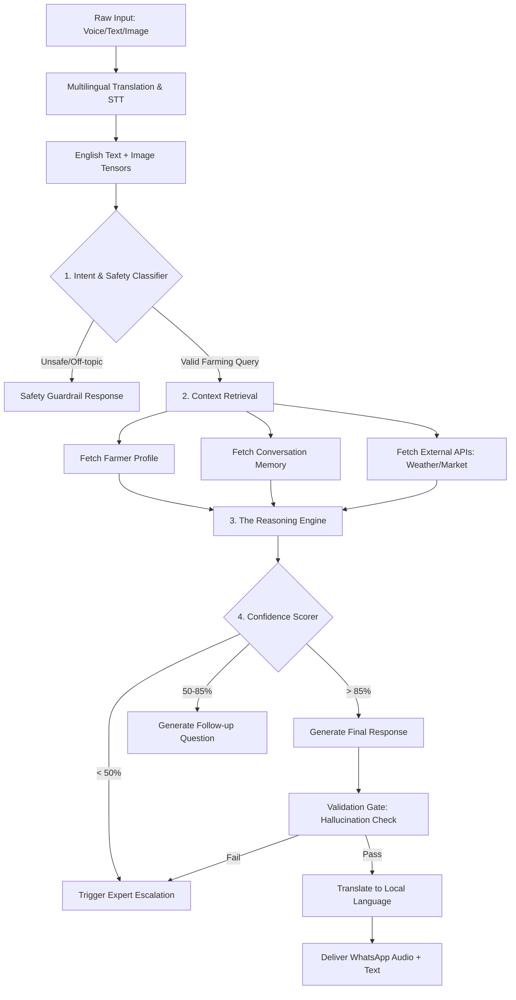
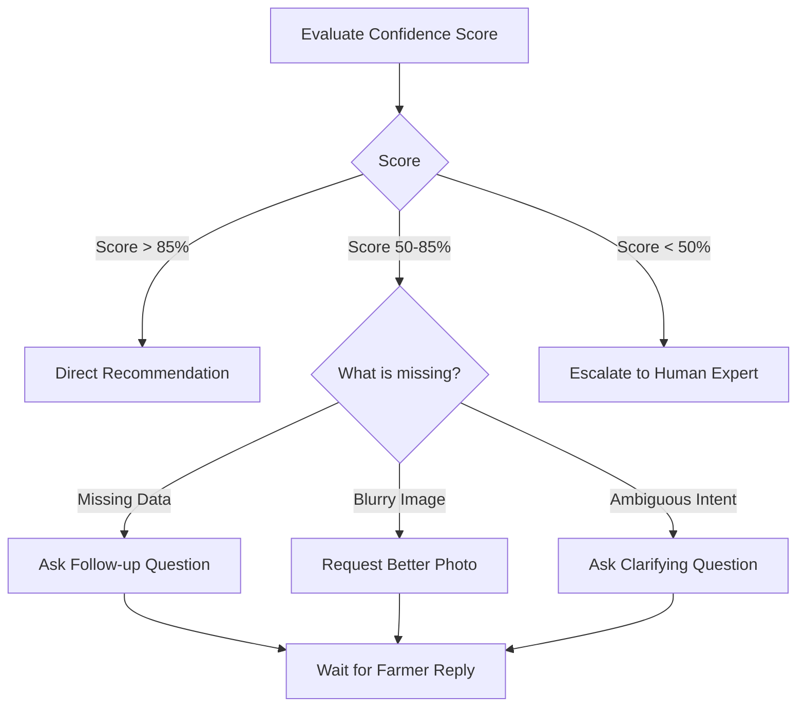

# 🧠 BhoomiMitra AI — AI Decision Engine Architecture

> **Document Type:** AI Architecture & Strategy  
> **Audience:** Machine Learning Engineers, Data Scientists, Backend Engineers  
> **Objective:** Define a robust, zero-hallucination AI reasoning engine capable of serving millions of Indian farmers.

## Core AI Philosophy
**"Never Guess. When in doubt, ask. When stuck, escalate."**
BhoomiMitra AI is not a generic chatbot. It is a highly constrained, domain-specific expert system powered by LLMs, ML classifiers, and deterministic logic gates.

---

## 1. High-Level AI Workflow Pipeline

The engine operates on a multi-stage pipeline. No query goes directly to an LLM without going through intent classification, context augmentation, and safety checks.

---

## 2. Memory Architecture (Short & Long Term)

The AI relies on a sophisticated dual-memory system to maintain context without exceeding context windows or hallucinating past facts.

### Short-Term Memory (Session Context)
- **Tech:** Redis. 
- **Scope:** The last 10 messages of the current active conversation.
- **Purpose:** Handling immediate multi-turn conversations (e.g., Q: "What's the price of cotton?" A: "7200." Q: "Is there a mandi nearby?").

### Long-Term Memory (Semantic Farmer Profile)
- **Tech:** PostgreSQL (JSONB) + Vector DB (Pinecone/Qdrant).
- **Scope:** Permanent.
- **Data Points Stored:** 
  - **Static:** Land size, soil type (e.g., Red/Black cotton soil), state, district.
  - **Dynamic:** Current crop, sowing date (used to calculate current crop stage), past diseases reported, preferred fertilizers.
- **Purpose:** "I see your Cotton is 45 days old now. Based on the red soil in Warangal..."

---

## 3. Confidence Scoring & Decision Tree

Every output from the reasoning engine is scored using a combination of deterministic rules and LLM logprobs/self-evaluation.

### How Confidence is Calculated:
1. **Data Completeness (40%):** Does the AI have all required parameters for this intent? (e.g., Fertilizer recommendation requires: Crop, Age, Soil Type).
2. **Model Certainty (40%):** Internal confidence of the LLM or Vision Model (e.g., Vision model is 92% sure it is Leaf Curl Virus).
3. **Historical Success (20%):** Has this recommendation been upvoted (thumbs up) by farmers in similar conditions recently?

### The Decision Tree

---

## 4. Multi-step Reasoning & Validation Pipeline

BhoomiMitra AI uses a **Chain-of-Thought (CoT)** approach to ensure logic is sound before sending a response.

**Internal Reasoning Trace (Not shown to user):**
1. *Intent:* Pesticide recommendation.
2. *Context:* Farmer grows Paddy, 60 days old. Image shows Stem Borer.
3. *Action Plan:* Identify chemical control for Stem Borer in Paddy at 60 days.
4. *Draft:* Recommend Chlorantraniliprole 18.5% SC.
5. *Validation Gate:* Is this chemical banned in India? (Checks against Safety DB). -> No.
6. *Validation Gate:* Is it safe at 60 days? -> Yes.
7. *Final Output Generation.*

---

## 5. Domain-Specific Understanding Pipelines

### A. Image Understanding (Crop Disease & Pests)
- **Model:** Ensemble of Google Cloud Vision API (for generic crop identification) and a custom fine-tuned CNN (ResNet/EfficientNet) trained purely on Indian crop diseases.
- **Fallback:** If CNN confidence is < 70%, immediately route the image to an Agriculture Expert's dashboard. Do not guess the disease.

### B. Voice Understanding
- **Model:** Whisper (OpenAI) / Google Speech-to-Text V2.
- **Processing:** Audio is transcribed in the native language, translated to English for the LLM core, then the response is translated back and converted to a WaveNet female voice (proven to have higher trust metrics among rural users).

### C. Context Injectors
Before the prompt hits the LLM, it is injected with real-time data:
- **Weather Context:** `[SYSTEM_INJECT: Heavy rainfall expected in 24 hrs in User District]`
- **Market Context:** `[SYSTEM_INJECT: Urea price capped at ₹266. Current Tomato mandi price: ₹2200/qtl]`

---

## 6. Safety Guardrails & Hallucination Prevention

**Strict limits on AI behavior:**

1. **The "Out of Bounds" Rule:** The AI must refuse to answer questions about politics, religion, non-agricultural medical advice, and financial investments.
2. **The "Banned Chemical" Rule:** A deterministic database check prevents the LLM from ever recommending banned pesticides (e.g., Monocrotophos on vegetables).
3. **The "Dosage Verification" Rule:** LLMs are bad at math. Fertilizer and pesticide dosages are calculated using deterministic Python functions, NOT the LLM. The LLM only formats the output.
4. **Emergency Crop Handling:** If the user text contains "dying", "destroyed", "loss", or "urgent", the AI bypasses standard confidence scoring and triggers Emergency Mode -> Connects to human expert immediately.

---

## 7. Continuous Learning from Farmer Feedback

The AI gets smarter every day using a **Reinforcement Learning from Human Feedback (RLHF)** loop.

1. **Implicit Feedback:** 
   - Did the farmer abandon the chat? (Negative signal)
   - Did the farmer click the Google Maps link to the agro shop? (Positive signal)
2. **Explicit Feedback:** 
   - Post-recommendation thumbs up/down (👍/👎).
3. **Expert Overrides:** 
   - When an expert resolves an escalated ticket, their exact response and the crop image are added to the training dataset.
4. **Model Updates:** Every week, low-confidence interactions and expert overrides are used to fine-tune the Intent Classifier and the Custom Vision models.
