# 🌾 KrishiMitra AI — Production Database Design

This document details the production-ready PostgreSQL database schema for KrishiMitra AI. It is designed for scalability, maintaining referential integrity, and fast querying across multiple domains.

---

## 1. Entity-Relationship (ER) Diagram

```mermaid
erDiagram
    %% Core Entities
    FARMER {
        uuid id PK
        string phone_number UK
        string preferred_language
        boolean is_active
        timestamp created_at
    }
    
    FARMER_PROFILE {
        uuid id PK
        uuid farmer_id FK
        string full_name
        float land_size_acres
        string soil_type
        string state
        string district
        string village
        geometry location
    }

    AGRICULTURE_EXPERT {
        uuid id PK
        string full_name
        string phone_number UK
        string specialization
        string language_spoken
        boolean is_available
    }

    %% Crop & Domain Knowledge
    CROP {
        uuid id PK
        string name UK
        string scientific_name
        string typical_season
        int duration_days
    }
    
    DISEASE {
        uuid id PK
        uuid crop_id FK
        string name
        string symptoms
        string treatment_plan
    }
    
    PEST {
        uuid id PK
        uuid crop_id FK
        string name
        string damage_signs
        string control_measures
    }
    
    GOVERNMENT_SCHEME {
        uuid id PK
        string scheme_name
        string eligibility_criteria
        string benefits
        string state_applicable
    }

    %% Farmer Crop Management
    FARMER_CROP {
        uuid id PK
        uuid farmer_id FK
        uuid crop_id FK
        date sowing_date
        date expected_harvest
        float area_acres
        string status
    }

    %% Products & Inventory
    PRODUCT_CATALOG {
        uuid id PK
        string type "Fertilizer, Pesticide, Micronutrient, Seed"
        string name
        string brand
        string composition
        string usage_instructions
    }
    
    AGRO_SHOP {
        uuid id PK
        string shop_name
        string owner_name
        string phone_number UK
        string address
        geometry location
        boolean is_verified
    }
    
    SHOP_INVENTORY {
        uuid id PK
        uuid shop_id FK
        uuid product_id FK
        float price
        int stock_quantity
        boolean in_stock
    }

    %% External Data (Time-series / Volatile)
    MARKET_PRICE {
        uuid id PK
        uuid crop_id FK
        string mandi_name
        string state
        date record_date
        float min_price
        float max_price
        float modal_price
    }
    
    WEATHER_RECORD {
        uuid id PK
        string district
        date record_date
        float min_temp
        float max_temp
        float rainfall_mm
        string weather_condition
    }

    %% Interactions & System Actions
    CONVERSATION {
        uuid id PK
        uuid farmer_id FK
        string session_id
        text user_message
        text ai_response
        string intent
        float confidence_score
        timestamp created_at
    }
    
    AI_RECOMMENDATION {
        uuid id PK
        uuid conversation_id FK
        uuid farmer_id FK
        string recommendation_type
        text content
        boolean applied_by_farmer
    }

    REMINDER_SCHEDULE {
        uuid id PK
        uuid farmer_id FK
        uuid farmer_crop_id FK
        string reminder_type
        date scheduled_date
        string status
    }
    
    NOTIFICATION {
        uuid id PK
        uuid farmer_id FK
        string title
        text content
        string channel
        string status
        timestamp sent_at
    }

    %% Relationships
    FARMER ||--o| FARMER_PROFILE : "has"
    FARMER ||--o{ FARMER_CROP : "grows"
    FARMER ||--o{ CONVERSATION : "initiates"
    FARMER ||--o{ REMINDER_SCHEDULE : "has"
    FARMER ||--o{ NOTIFICATION : "receives"
    
    CROP ||--o{ DISEASE : "susceptible to"
    CROP ||--o{ PEST : "attacked by"
    CROP ||--o{ FARMER_CROP : "is"
    CROP ||--o{ MARKET_PRICE : "priced at"
    
    AGRO_SHOP ||--o{ SHOP_INVENTORY : "maintains"
    PRODUCT_CATALOG ||--o{ SHOP_INVENTORY : "listed in"
    
    CONVERSATION ||--o{ AI_RECOMMENDATION : "generates"
    FARMER_CROP ||--o{ REMINDER_SCHEDULE : "triggers"
```

---

## 2. Table Definitions & Indexes

### A. Core User Management

**1. `farmers`**
- `id` (UUID, PK)
- `phone_number` (VARCHAR, Unique, Indexed)
- `preferred_language` (VARCHAR)
- `is_active` (BOOLEAN, Default True)
- `created_at`, `updated_at` (TIMESTAMP)

**2. `farmer_profiles`**
- `id` (UUID, PK)
- `farmer_id` (UUID, FK -> farmers.id, Unique)
- `full_name` (VARCHAR)
- `land_size_acres` (DECIMAL)
- `soil_type` (VARCHAR)
- `state`, `district`, `village` (VARCHAR, Indexed for regional queries)
- `location` (POSTGIS GEOMETRY(Point, 4326), Indexed with GIST for spatial queries)

**3. `agriculture_experts`**
- `id` (UUID, PK)
- `full_name` (VARCHAR)
- `phone_number` (VARCHAR, Unique)
- `specialization` (VARCHAR)
- `language_spoken` (VARCHAR ARRAY)
- `is_available` (BOOLEAN)

---

### B. Agricultural Knowledge Base

**4. `crops`**
- `id` (UUID, PK)
- `name` (VARCHAR, Unique)
- `scientific_name` (VARCHAR)
- `typical_season` (VARCHAR)
- `duration_days` (INT)

**5. `diseases` & `pests`** (Similar structure)
- `id` (UUID, PK)
- `crop_id` (UUID, FK -> crops.id)
- `name` (VARCHAR)
- `damage_signs` / `symptoms` (TEXT)
- `control_measures` / `treatment_plan` (TEXT)
- *Index on `crop_id`*

**6. `government_schemes`**
- `id` (UUID, PK)
- `scheme_name` (VARCHAR)
- `eligibility_criteria` (TEXT)
- `benefits` (TEXT)
- `state_applicable` (VARCHAR, Indexed)

---

### C. Farmer Crop Management

**7. `farmer_crops`**
- `id` (UUID, PK)
- `farmer_id` (UUID, FK -> farmers.id, Indexed)
- `crop_id` (UUID, FK -> crops.id)
- `sowing_date` (DATE)
- `expected_harvest` (DATE)
- `area_acres` (DECIMAL)
- `status` (VARCHAR: 'Active', 'Harvested', 'Failed')

---

### D. Products & Agro Shops

**8. `product_catalog`** (Covers Fertilizers, Pesticides, Micronutrients, Seeds)
- `id` (UUID, PK)
- `type` (VARCHAR: 'Fertilizer', 'Pesticide', 'Micronutrient', 'Seed', Indexed)
- `name` (VARCHAR)
- `brand` (VARCHAR)
- `composition` (TEXT)
- `usage_instructions` (TEXT)

**9. `agro_shops`**
- `id` (UUID, PK)
- `shop_name` (VARCHAR)
- `owner_name` (VARCHAR)
- `phone_number` (VARCHAR, Unique)
- `address` (TEXT)
- `location` (POSTGIS GEOMETRY(Point, 4326), Indexed with GIST for proximity search)
- `is_verified` (BOOLEAN)

**10. `shop_inventory`**
- `id` (UUID, PK)
- `shop_id` (UUID, FK -> agro_shops.id)
- `product_id` (UUID, FK -> product_catalog.id)
- `price` (DECIMAL)
- `stock_quantity` (INT)
- `in_stock` (BOOLEAN)
- *Composite Unique Index on `(shop_id, product_id)`*

---

### E. Time-Series & Market Data

**11. `market_prices`**
- `id` (UUID, PK)
- `crop_id` (UUID, FK -> crops.id)
- `mandi_name` (VARCHAR)
- `state` (VARCHAR)
- `record_date` (DATE)
- `min_price`, `max_price`, `modal_price` (DECIMAL)
- *Composite Index on `(crop_id, mandi_name, record_date)` for fast trend lookups.*

**12. `weather_records`**
- `id` (UUID, PK)
- `district` (VARCHAR, Indexed)
- `record_date` (DATE)
- `min_temp`, `max_temp`, `rainfall_mm` (DECIMAL)
- `weather_condition` (VARCHAR)
- *Index on `(district, record_date)`*

---

### F. Interactions & System Operations

**13. `conversations`**
- `id` (UUID, PK)
- `farmer_id` (UUID, FK -> farmers.id, Indexed)
- `session_id` (VARCHAR)
- `user_message` (TEXT)
- `ai_response` (TEXT)
- `intent` (VARCHAR)
- `confidence_score` (DECIMAL)
- `created_at` (TIMESTAMP)

**14. `ai_recommendations`**
- `id` (UUID, PK)
- `conversation_id` (UUID, FK -> conversations.id)
- `farmer_id` (UUID, FK -> farmers.id)
- `recommendation_type` (VARCHAR)
- `content` (TEXT)
- `applied_by_farmer` (BOOLEAN, Default False)

**15. `reminder_schedules`**
- `id` (UUID, PK)
- `farmer_id` (UUID, FK -> farmers.id)
- `farmer_crop_id` (UUID, FK -> farmer_crops.id, Nullable)
- `reminder_type` (VARCHAR: 'Fertilizer', 'Pesticide', 'Harvest')
- `scheduled_date` (DATE, Indexed)
- `status` (VARCHAR: 'Pending', 'Sent', 'Cancelled')

**16. `notifications`**
- `id` (UUID, PK)
- `farmer_id` (UUID, FK -> farmers.id)
- `title` (VARCHAR)
- `content` (TEXT)
- `channel` (VARCHAR: 'WhatsApp', 'SMS')
- `status` (VARCHAR: 'Sent', 'Failed', 'Delivered')
- `sent_at` (TIMESTAMP, Indexed)

---

## 3. Database Scalability & Performance Details

1. **PostGIS for Location Data:** The `location` fields in `farmer_profiles` and `agro_shops` utilize the `GEOMETRY(Point, 4326)` type. Using GiST indexing allows incredibly fast spatial queries (e.g., "Find agro shops within 15km of the farmer's location").
2. **UUIDs for Primary Keys:** Prevents ID enumeration attacks and makes data merging/migration safe across distributed systems.
3. **Partitioning Strategy:**
    - `conversations`: Partitioned by Month/Year as this will grow massive quickly.
    - `market_prices` & `weather_records`: Partitioned by Year.
4. **Denormalization (Where Necessary):** While normalized, the `farmer_profiles` table caches `state` and `district` to avoid heavy spatial joins every time region-based querying is needed (e.g. for weather or schemes). 
5. **JSONB Columns (Optional):** If product metadata varies wildly between fertilizers and seeds, a `metadata` JSONB column can be added to `product_catalog` to avoid sparse table schemas.
