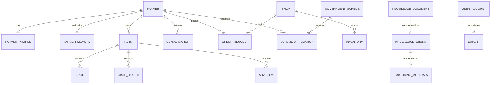

# 🌾 BhoomiMitra AI — Production Database Design

This document details the production-ready PostgreSQL and SQLite database schema for BhoomiMitra AI. It is designed for scalability, maintaining referential integrity, and fast spatial and contextual querying across agricultural domains.

---

## 1. Entity-Relationship (ER) Architecture

---

## 2. Table Definitions & Schemas

### A. Core Farmer & Identity

**1. `farmers`**
- `id` (UUID, PK)
- `phone_number` (VARCHAR(20), Unique, Indexed)
- `preferred_language` (VARCHAR(10), Default 'te')
- `is_active` (BOOLEAN, Default True)
- `created_at`, `updated_at` (TIMESTAMP)

**2. `farmer_profiles`**
- `id` (UUID, PK)
- `farmer_id` (UUID, FK -> farmers.id, Unique, Indexed)
- `full_name` (VARCHAR(100))
- `state` (VARCHAR(50), Indexed)
- `district` (VARCHAR(50), Indexed)
- `mandal` (VARCHAR(50))
- `village` (VARCHAR(50))
- `land_size_acres` (FLOAT)
- `current_crop` (VARCHAR(50))
- `created_at`, `updated_at` (TIMESTAMP)

**3. `farmer_memory`**
- `id` (UUID, PK)
- `farmer_id` (UUID, FK -> farmers.id, Unique, Indexed)
- `preferred_voice`, `voice_speed`, `voice_gender` (VARCHAR)
- `farm_size`, `village`, `district`, `state` (VARCHAR)
- `soil_type`, `water_source`, `irrigation_method` (VARCHAR)
- `crop_history` (JSON: list of historical crops and seasons)
- `disease_history` (JSON: past diagnoses and treatments)
- `fertilizer_history` (JSON: application logs)
- `pesticide_history` (JSON: spray records)
- `scheme_history` (JSON: applied schemes and subsidies)
- `expert_consultation_history` (JSON: human expert escalation tickets, assigned AEOs, statuses, and resolution notes)
- `gps_coordinates` (JSON: latitude/longitude)
- `created_at`, `updated_at` (TIMESTAMP)

---

### B. Farm Parcels, Crops & Diagnostics

**4. `farms`**
- `id` (UUID, PK)
- `farmer_id` (UUID, FK -> farmers.id, Indexed)
- `name` (VARCHAR(100))
- `size_acres` (FLOAT)
- `soil_type` (VARCHAR(50))
- `irrigation_type` (VARCHAR(50))
- `latitude`, `longitude` (FLOAT)
- `state`, `district`, `mandal`, `village` (VARCHAR(50))
- `created_at`, `updated_at` (TIMESTAMP)

**5. `crops`**
- `id` (UUID, PK)
- `farm_id` (UUID, FK -> farms.id, Indexed)
- `name` (VARCHAR(100), Indexed)
- `variety` (VARCHAR(100))
- `sowing_date` (DATE)
- `stage` (VARCHAR(50))
- `status` (VARCHAR(20), Default 'active')
- `created_at`, `updated_at` (TIMESTAMP)

**6. `crop_health`**
- `id` (UUID, PK)
- `farm_id` (UUID, FK -> farms.id, Indexed)
- `crop_name` (VARCHAR(100))
- `image_url` (VARCHAR(500))
- `symptoms` (TEXT)
- `diagnosis` (TEXT)
- `confidence_score` (FLOAT)
- `is_healthy` (BOOLEAN, Default True)
- `disease_name` (VARCHAR(100))
- `severity` (VARCHAR(20))
- `created_at`, `updated_at` (TIMESTAMP)

**7. `advisories`**
- `id` (UUID, PK)
- `farm_id` (UUID, FK -> farms.id, Indexed)
- `crop_name` (VARCHAR(100))
- `advisory_type` (VARCHAR(50))
- `title` (VARCHAR(200))
- `content` (TEXT)
- `priority` (VARCHAR(20), Default 'normal')
- `created_at`, `updated_at` (TIMESTAMP)

---

### C. Authentication & Expert Management

**8. `user_accounts`**
- `id` (UUID, PK)
- `email` (VARCHAR(255), Unique, Indexed)
- `hashed_password` (VARCHAR(255))
- `full_name` (VARCHAR(255))
- `phone_number` (VARCHAR(20), Unique)
- `role` (VARCHAR(50), Default 'expert': 'admin', 'expert', 'shop_owner')
- `is_active` (BOOLEAN, Default True)
- `created_at`, `updated_at` (TIMESTAMP)

**9. `experts`**
- `id` (UUID, PK)
- `name` (VARCHAR(100))
- `designation` (VARCHAR(100))
- `department` (VARCHAR(100))
- `specialization` (VARCHAR(100))
- `phone` (VARCHAR(20), Unique)
- `email` (VARCHAR(100), Unique)
- `district` (VARCHAR(50), Indexed)
- `state` (VARCHAR(50), Indexed)
- `is_active` (BOOLEAN, Default True)
- `rating` (FLOAT, Default 5.0)
- `total_consultations` (INT, Default 0)
- `created_at`, `updated_at` (TIMESTAMP)

---

### D. Hyperlocal Input Commerce & Orders

**10. `shops`**
- `id` (UUID, PK)
- `name` (VARCHAR(150), Indexed)
- `owner_name` (VARCHAR(100))
- `phone` (VARCHAR(20), Unique)
- `email` (VARCHAR(100))
- `address` (TEXT)
- `village`, `mandal`, `district`, `state` (VARCHAR(50), Indexed)
- `pincode` (VARCHAR(10))
- `latitude`, `longitude` (FLOAT)
- `delivery_radius_km` (FLOAT, Default 15.0)
- `rating` (FLOAT, Default 4.5)
- `status` (VARCHAR(20), Default 'active')
- `license_number` (VARCHAR(50))
- `created_at`, `updated_at` (TIMESTAMP)

**11. `inventory`**
- `id` (UUID, PK)
- `shop_id` (UUID, FK -> shops.id, Indexed)
- `product_name` (VARCHAR(150), Indexed)
- `category` (VARCHAR(50): 'fertilizer', 'pesticide', 'seed', 'machinery', 'micronutrient', Indexed)
- `brand` (VARCHAR(100), Indexed)
- `unit` (VARCHAR(20): 'kg', 'litre', 'packet', 'bag')
- `price_per_unit` (FLOAT)
- `quantity_available` (FLOAT)
- `reorder_threshold` (FLOAT, Default 10.0)
- `available` (BOOLEAN, Default True, Indexed)
- `created_at`, `updated_at` (TIMESTAMP)

**12. `order_requests`**
- `id` (UUID, PK)
- `farmer_id` (UUID, FK -> farmers.id, Indexed)
- `shop_id` (UUID, FK -> shops.id, Indexed)
- `inventory_id` (UUID, FK -> inventory.id)
- `product_name` (VARCHAR(150))
- `quantity` (FLOAT)
- `unit` (VARCHAR(20))
- `total_price` (FLOAT)
- `status` (VARCHAR(20): 'pending', 'confirmed', 'delivered', 'cancelled', Default 'pending')
- `delivery_address` (TEXT)
- `farmer_phone` (VARCHAR(20))
- `payment_status` (VARCHAR(20): 'unpaid', 'paid', 'refunded', Default 'unpaid')
- `notes` (TEXT)
- `created_at`, `updated_at` (TIMESTAMP)

---

### E. Government Schemes & Subsidies

**13. `government_schemes`**
- `id` (UUID, PK)
- `name` (VARCHAR(200), Indexed)
- `name_te` (VARCHAR(200))
- `name_hi` (VARCHAR(200))
- `category` (VARCHAR(50))
- `description`, `description_te` (TEXT)
- `benefits` (TEXT)
- `subsidy_percentage` (FLOAT)
- `max_subsidy_amount` (FLOAT)
- `min_land_acres`, `max_land_acres` (FLOAT)
- `eligible_crops` (TEXT)
- `eligible_states` (TEXT)
- `application_url` (VARCHAR(500))
- `deadline` (DATE)
- `status` (VARCHAR(20), Default 'active')
- `created_at`, `updated_at` (TIMESTAMP)

**14. `scheme_applications`**
- `id` (UUID, PK)
- `farmer_id` (UUID, FK -> farmers.id, Indexed)
- `scheme_id` (UUID, FK -> government_schemes.id, Indexed)
- `status` (VARCHAR(20): 'submitted', 'in_review', 'approved', 'rejected', Default 'submitted')
- `applied_at` (TIMESTAMP)
- `notes` (TEXT)

---

### F. APMC Mandi Market Prices

**15. `market_prices`**
- `id` (UUID, PK)
- `commodity` (VARCHAR(100), Indexed)
- `variety` (VARCHAR(100))
- `market` (VARCHAR(100), Indexed)
- `district` (VARCHAR(100), Indexed)
- `state` (VARCHAR(100), Indexed)
- `min_price`, `max_price`, `modal_price` (FLOAT)
- `arrivals_tonnes` (FLOAT)
- `price_date` (DATE, Indexed)
- `created_at`, `updated_at` (TIMESTAMP)

---

### G. Grounded RAG Knowledge Engine

**16. `knowledge_documents`**
- `id` (UUID, PK)
- `filename` (VARCHAR(255))
- `title` (VARCHAR(255))
- `source_institution` (VARCHAR(100))
- `crop` (VARCHAR(100))
- `category` (VARCHAR(100))
- `total_chunks` (INT, Default 0)
- `created_at`, `updated_at` (TIMESTAMP)

**17. `knowledge_chunks`**
- `id` (UUID, PK)
- `document_id` (UUID, FK -> knowledge_documents.id, Indexed)
- `chunk_index` (INT)
- `page_number` (INT)
- `content` (TEXT)
- `metadata_json` (JSON)
- `created_at` (TIMESTAMP)

**18. `embedding_metadata`**
- `id` (UUID, PK)
- `chunk_id` (UUID, FK -> knowledge_chunks.id, Indexed)
- `embedding_vector` (TEXT / Array: 768-dimension Gemini vector)
- `dimension` (INT, Default 768)
- `model_name` (VARCHAR(100))
- `created_at` (TIMESTAMP)

---

### H. Multi-Turn Conversations

**19. `conversations`**
- `id` (UUID, PK)
- `farmer_id` (UUID, FK -> farmers.id, Indexed)
- `user_message` (TEXT)
- `ai_response` (TEXT)
- `language` (VARCHAR(10))
- `intent` (VARCHAR(50))
- `confidence_score` (FLOAT)
- `message_id` (VARCHAR(100), Unique, Indexed)
- `created_at` (TIMESTAMP)

---

## 3. Storage Architecture Highlights

1. **Haversine Geo-Computation**: Nearby shop discovery computes spherical distance in Python/SQL without requiring heavy GIS extensions for lightweight edge deployment.
2. **Dynamic JSON Contextual Storage**: Dynamic agricultural parameters (past diagnoses, spray logs, crop cycles, and human escalation tickets) are stored within `FarmerMemory` JSON fields for fast single-query ingestion into Gemini system prompts.
3. **Hybrid Vector & Keyword Indexing**: Chunk embeddings and keyword frequencies are paired with document metadata scoring for verified, zero-hallucination agronomic retrieval.
