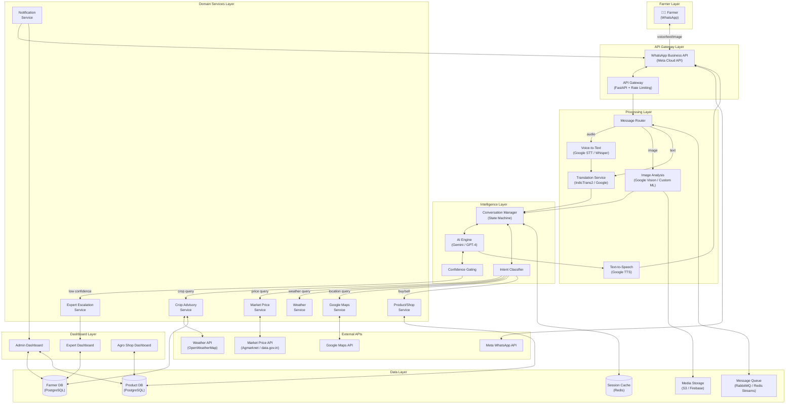
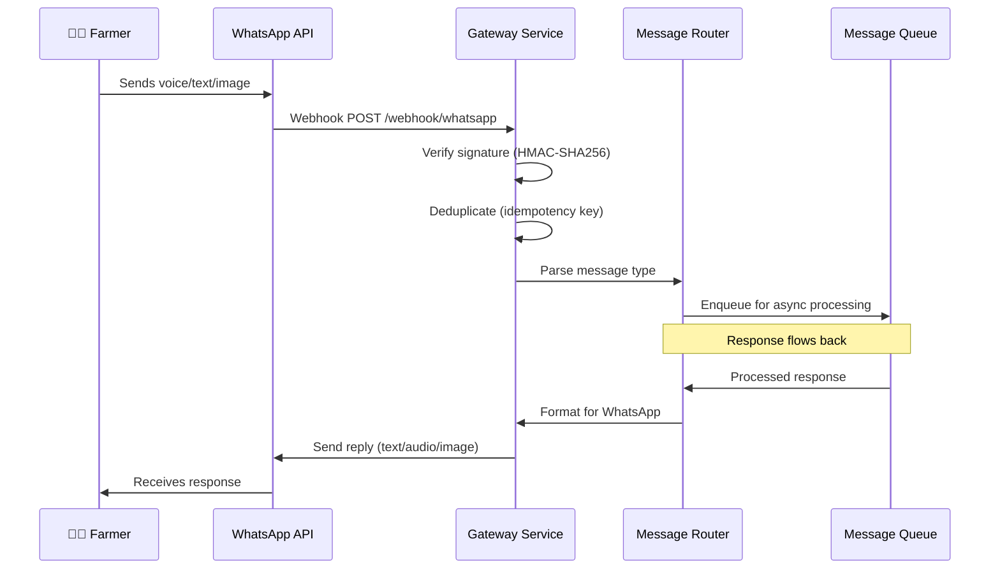
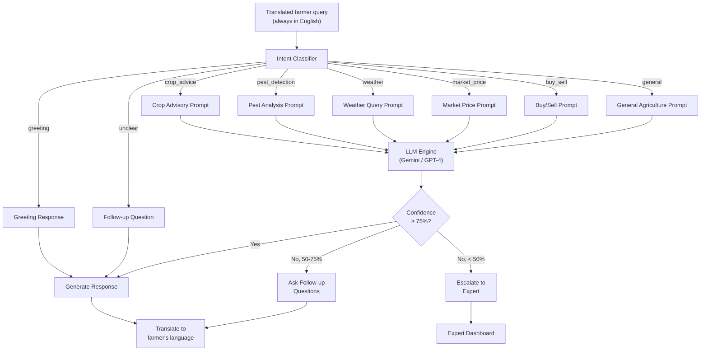
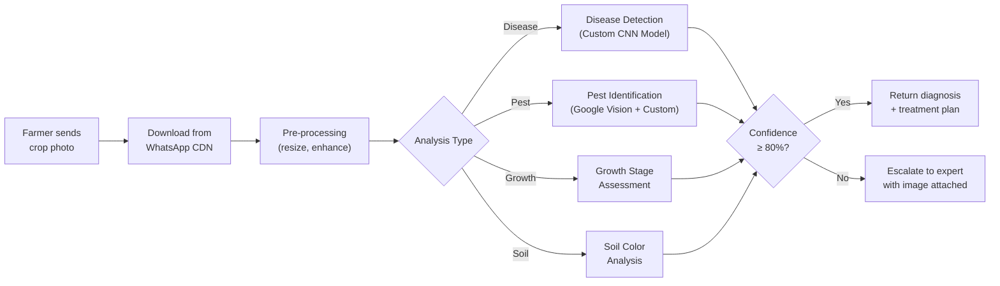
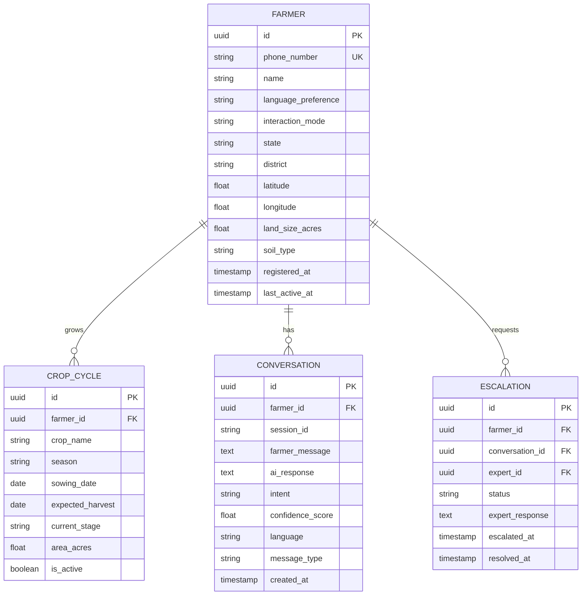
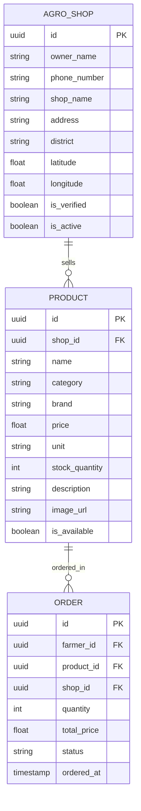
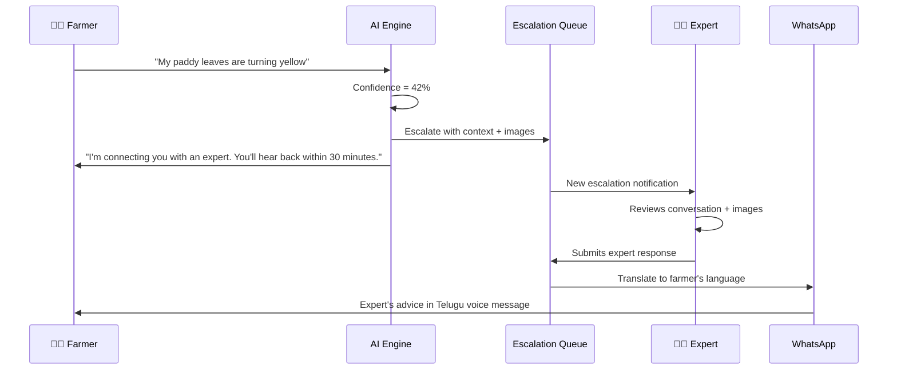
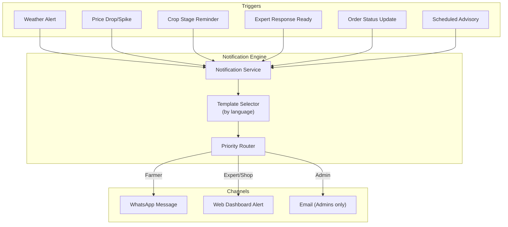
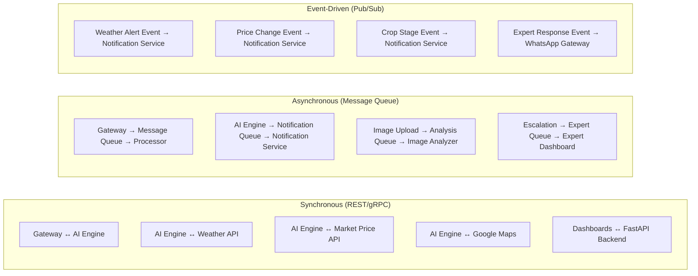
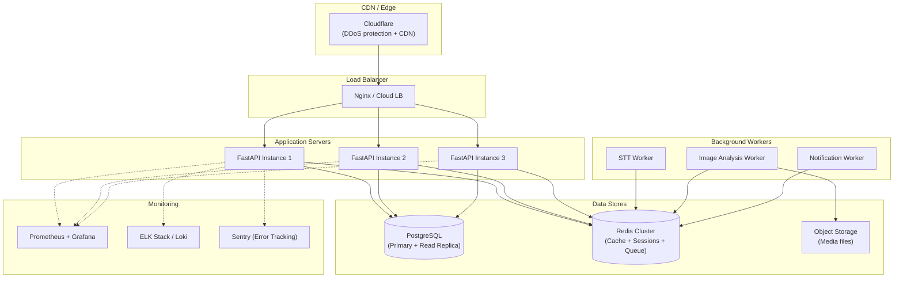

# 🌾 KrishiMitra AI — Enterprise Architecture Document

> **Version:** 1.0  
> **Date:** July 2026  
> **Status:** Design Phase  
> **Classification:** Confidential — Internal Use Only

---

## 1. System Overview

KrishiMitra AI is a multi-tenant, AI-powered WhatsApp farming assistant that serves **three distinct user groups** through **two interaction channels**:

| User Group | Channel | Interaction Mode |
|-----------|---------|-----------------|
| **Farmers** | WhatsApp only | Voice, text, images — in local languages |
| **Agro Shop Owners** | Web Dashboard | Browse farmer requests, list products |
| **Agriculture Experts** | Web Dashboard | Review escalated queries, provide advice |
| **System Admins** | Web Dashboard | Monitor, analytics, user management |

---

## 2. High-Level Architecture

---

## 3. Module-by-Module Deep Dive

### 3.1 WhatsApp Business API Gateway

> **Purpose:** Single entry/exit point for all farmer communication.

**Key Details:**
- **Webhook verification** using Meta's verify token handshake
- **HMAC-SHA256 signature validation** on every incoming request
- **Idempotency** — deduplicates messages using WhatsApp message IDs
- **Rate limiting** — per-farmer throttle (60 messages/minute)
- **Message types handled:** text, audio, image, location, interactive buttons

---

### 3.2 AI Engine

> **Purpose:** The brain of KrishiMitra. Processes farmer queries, generates responses, and gates confidence.

**Key Design Decisions:**
- **Never guesses** — three-tier confidence gating (respond / clarify / escalate)
- **Intent classification** happens BEFORE hitting the LLM to reduce cost
- All queries are **translated to English** before LLM processing, responses **translated back**
- **Prompt templates** per intent — not a generic "answer anything" prompt
- **Context window** — last 10 messages in conversation for continuity
- **Fallback chain:** Gemini → GPT-4 → Expert escalation

---

### 3.3 Voice-to-Text (STT)

> **Purpose:** Convert farmer voice messages to text for AI processing.

| Feature | Detail |
|---------|--------|
| **Primary Engine** | Google Cloud Speech-to-Text V2 |
| **Fallback Engine** | OpenAI Whisper (self-hosted) |
| **Supported Languages** | Telugu, Hindi, Kannada, Tamil, English |
| **Audio Format** | OGG/OPUS (WhatsApp native) → converted to WAV |
| **Max Duration** | 5 minutes per voice message |
| **Noise Handling** | Agricultural background noise filtering model |

**Flow:**
1. Gateway receives audio message → downloads media from WhatsApp CDN
2. Audio stored temporarily in media storage (S3/Firebase)
3. Language detection (auto-detect from farmer profile or audio)
4. STT transcription in detected language
5. Transcribed text → Translation Service → English
6. English text → AI Engine

---

### 3.4 Text-to-Speech (TTS)

> **Purpose:** Convert AI text responses to voice messages for farmers who can't read.

| Feature | Detail |
|---------|--------|
| **Engine** | Google Cloud Text-to-Speech |
| **Voice Type** | WaveNet (natural-sounding) |
| **Languages** | Telugu, Hindi, Kannada, Tamil, English |
| **Output Format** | OGG/OPUS for WhatsApp delivery |
| **Voice Selection** | Female regional voice (tested for farmer trust) |

**When TTS is triggered:**
- Farmer sent a voice message → reply with voice
- Farmer's profile has `preferred_mode: voice`
- Response contains complex instructions (always send voice + text)

---

### 3.5 Image Analysis

> **Purpose:** Analyze crop photos for disease detection, pest identification, and growth stage assessment.

**Model Pipeline:**
- **Primary:** Google Cloud Vision API for general classification
- **Secondary:** Custom-trained model on Indian crop disease dataset
- **Image storage:** All images stored with metadata for model retraining
- **Privacy:** Images are NOT shared — only expert sees them if escalated

---

### 3.6 Farmer Database

> **Purpose:** Complete farmer profile, crop history, and interaction log.

---

### 3.7 Product Database

> **Purpose:** Agro shop inventory — seeds, fertilizers, pesticides, equipment.

---

### 3.8 Agro Shop Dashboard

> **Purpose:** Web dashboard for agro shop owners to manage inventory and farmer requests.

**Features:**
| Feature | Description |
|---------|------------|
| Product Management | Add, edit, delete products with images & pricing |
| Order Tracking | View farmer orders, update delivery status |
| Farmer Requests | See nearby farmers asking for products |
| Inventory Alerts | Low stock notifications |
| Sales Analytics | Revenue, top products, demand trends |
| Location Radius | Set delivery radius on map |

**Tech:** React.js SPA → FastAPI REST endpoints → PostgreSQL

---

### 3.9 Agriculture Expert Dashboard

> **Purpose:** Dashboard for agriculture experts to handle escalated farmer queries.

**Features:**
| Feature | Description |
|---------|------------|
| Escalation Queue | Real-time queue of unresolved farmer queries |
| Farmer Context | Full conversation history + crop profile |
| Image Viewer | High-res crop disease images with AI pre-diagnosis |
| Response Panel | Type response → auto-translated → sent to farmer via WhatsApp |
| Knowledge Base | Searchable library of past diagnoses and solutions |
| Expert Analytics | Queries handled, avg response time, satisfaction |

---

### 3.10 Admin Dashboard

> **Purpose:** System-wide monitoring, user management, and analytics.

**Features:**
| Category | Features |
|----------|---------|
| **User Management** | Farmers, experts, shop owners — CRUD, verification |
| **System Health** | API uptime, queue depth, error rates, latency |
| **AI Analytics** | Confidence distribution, escalation rate, intent breakdown |
| **Conversation Monitor** | Live feed, search, flag/review conversations |
| **Financial** | API costs (LLM, STT, TTS), cost per farmer |
| **Reports** | Daily/weekly/monthly — farmers served, queries resolved |
| **Config** | Confidence thresholds, supported languages, feature flags |

---

### 3.11 Weather API Integration

> **Purpose:** Hyper-local weather data for crop advisories and alerts.

| Feature | Detail |
|---------|--------|
| **Provider** | OpenWeatherMap API + IMD (India Meteorological Dept) |
| **Data Points** | Temperature, humidity, rainfall, wind, UV index |
| **Forecast** | 7-day forecast with 3-hour granularity |
| **Alerts** | Severe weather push notifications to affected farmers |
| **Caching** | Redis cache — 30 min TTL per district |

**Proactive Alerts Flow:**
1. Cron job fetches weather every 30 minutes per active district
2. If severe weather detected → query Farmer DB for affected farmers
3. Notification Service → WhatsApp alert in farmer's language
4. Alert includes: what's coming, crop protection tips, timing

---

### 3.12 Market Price API

> **Purpose:** Real-time mandi (market) prices so farmers know when and where to sell.

| Feature | Detail |
|---------|--------|
| **Data Source** | Agmarknet (data.gov.in), eNAM API |
| **Coverage** | 2,500+ mandis across India |
| **Data Points** | Commodity, mandi, min/max/modal price, arrival quantity |
| **Update Frequency** | Daily scrape + API pull |
| **Farmer Value** | "Should I sell today or wait?" — price trend analysis |

**Query Flow:**
- Farmer: "What's the price of tomatoes in Warangal?"
- System: Fetches from cached mandi data → formats response
- Adds: price trend (↑/↓), best mandi within 50km, optimal selling window

---

### 3.13 Google Maps Integration

> **Purpose:** Location-based services — nearest shops, mandis, experts, soil testing labs.

**Use Cases:**
| Use Case | How It Works |
|----------|-------------|
| Nearest agro shop | Farmer shares location → find shops within radius |
| Best mandi to sell | Compare prices at mandis within 50km |
| Soil testing labs | Locate nearest govt/private soil testing facility |
| Expert visit | Route expert to farmer's field |
| Delivery tracking | Track product delivery from shop to farmer |

---

### 3.14 Notification Service

> **Purpose:** Proactive push notifications to farmers, experts, and shop owners.

**Notification Types:**
| Type | Target | Priority | Example |
|------|--------|----------|---------|
| Weather Alert | Farmers in affected area | 🔴 Critical | "Heavy rain expected tomorrow. Cover your cotton crop." |
| Price Alert | Farmers growing that crop | 🟡 Medium | "Tomato prices up 20% at Madanapalle mandi today." |
| Crop Reminder | Individual farmer | 🟢 Low | "Your paddy is 45 days old. Time for second fertilizer dose." |
| Expert Reply | Individual farmer | 🔴 Critical | "Expert Dr. Rao has responded to your query." |
| Order Update | Individual farmer | 🟡 Medium | "Your pesticide order has been dispatched." |

---

## 4. Inter-Module Communication Map

### Communication Matrix

| From → To | Protocol | Pattern | Why |
|-----------|----------|---------|-----|
| WhatsApp → Gateway | HTTPS Webhook | Sync | Meta requires webhook response < 5s |
| Gateway → Message Router | Internal | Sync | Same service, function call |
| Router → STT/Image Analysis | Message Queue | Async | Media processing is slow (2-10s) |
| STT → Translation | Internal | Sync | Sequential pipeline |
| Translation → AI Engine | Internal | Sync | Need response to continue |
| AI Engine → Weather API | HTTP | Sync + Cache | Real-time data, cached 30 min |
| AI Engine → Market Price API | HTTP | Sync + Cache | Cached daily, refresh on demand |
| AI Engine → Google Maps | HTTP | Sync + Cache | Location data, cached 24 hours |
| AI Engine → Escalation Service | Message Queue | Async | Expert response is deferred |
| Notification Service → WhatsApp | HTTP | Async + Retry | Fire-and-forget with retry queue |
| Dashboards → Backend API | REST/WebSocket | Sync + Push | REST for CRUD, WebSocket for real-time |
| Cron Jobs → Notification Service | Internal Event | Scheduled | Weather checks, crop reminders |

---

## 5. Infrastructure Architecture

---

## 6. Security Architecture

| Layer | Protection |
|-------|-----------|
| **Transport** | TLS 1.3 everywhere, HTTPS only |
| **Authentication** | Webhook: HMAC-SHA256 signature verification |
| **Authorization** | JWT + RBAC for dashboards (admin, expert, shop_owner) |
| **Data at Rest** | AES-256 encryption for PII (phone numbers, locations) |
| **API Security** | Rate limiting, input validation, SQL injection prevention |
| **Secrets** | Environment variables, never in code. Vault for production |
| **Audit** | Every API call logged with actor, action, timestamp |
| **Compliance** | GDPR-ready data deletion, farmer consent tracking |

---

## 7. Scalability Strategy

| Phase | Farmers | Infrastructure |
|-------|---------|---------------|
| **MVP** | 0 - 1,000 | Single server, managed PostgreSQL |
| **Growth** | 1K - 50K | 3 app servers, Redis cluster, read replica |
| **Scale** | 50K - 500K | Kubernetes, auto-scaling, multi-region |
| **Enterprise** | 500K+ | Microservices, dedicated ML infra, CDN |

---

## 8. Tech Stack Summary

| Component | Technology | Justification |
|-----------|-----------|--------------|
| **Backend API** | FastAPI (Python 3.11+) | Async, fast, auto-docs, type-safe |
| **Database** | PostgreSQL 16 | ACID, JSON support, proven at scale |
| **Cache/Queue** | Redis 7 | Session store + message queue + cache |
| **AI/LLM** | Google Gemini + OpenAI GPT-4 | Dual-provider resilience |
| **STT** | Google Cloud Speech V2 | Best for Indian languages |
| **TTS** | Google Cloud TTS (WaveNet) | Natural-sounding regional voices |
| **Translation** | IndicTrans2 + Google Translate | IndicTrans2 for accuracy, Google as fallback |
| **Image ML** | Google Vision + Custom CNN | Vision for general, custom for crop disease |
| **Object Storage** | AWS S3 / Firebase Storage | Scalable media storage |
| **Frontend** | React.js + TypeScript | Dashboards (admin, expert, shop) |
| **Monitoring** | Prometheus + Grafana + Sentry | Metrics, dashboards, error tracking |
| **CI/CD** | GitHub Actions | Automated testing + deployment |
| **Hosting** | Railway / AWS / GCP | Start managed, migrate to K8s at scale |
