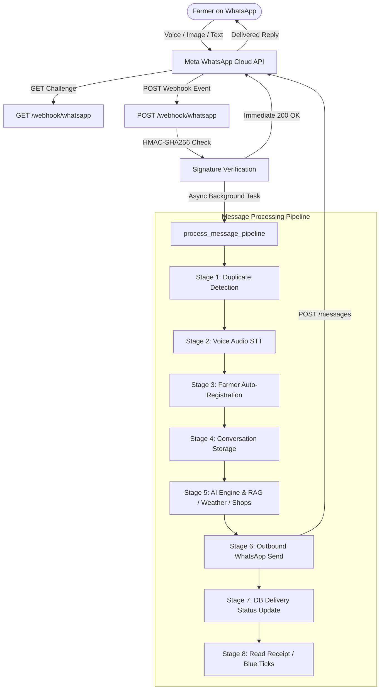

# BhoomiMitra AI — WhatsApp Integration & Architecture Guide

## 1. Overview & Architecture

BhoomiMitra AI is an AI-powered conversational farming assistant built on FastAPI, Meta's WhatsApp Cloud API (v20.0), and Google Gemini. It empowers farmers across India by providing agronomic advisory, crop disease diagnosis, local weather forecasts, market mandi prices, government scheme eligibility, and nearby input shop inventory — in English, Telugu, and other regional languages.



---

## 2. Meta WhatsApp Cloud API Setup

### 2.1 Developer Portal Registration
1. Navigate to the [Meta for Developers Portal](https://developers.facebook.com/).
2. Create or select your Business App (type: **Business**).
3. Add the **WhatsApp** product to your app.
4. Obtain your **Phone Number ID**, **WhatsApp Business Account ID**, and **App Secret**.
5. Generate a System User or Permanent Access Token with permissions:
   - `whatsapp_business_messaging`
   - `whatsapp_business_management`

### 2.2 Webhook Configuration
- **Callback URL**: `https://<your-render-domain>.onrender.com/webhook/whatsapp`
- **Verify Token**: Set a strong random token (configured in `WHATSAPP_VERIFY_TOKEN`).
- **Webhook Fields**: Subscribe to `messages`.

### 2.3 Verification Flow (`GET /webhook/whatsapp`)
Meta sends a GET request to verify endpoint ownership:
```http
GET /webhook/whatsapp?hub.mode=subscribe&hub.challenge=115820120&hub.verify_token=YOUR_VERIFY_TOKEN HTTP/1.1
Host: your-domain.com
```
BhoomiMitra validates that `hub.mode == "subscribe"` and `hub.verify_token == settings.whatsapp_verify_token`, then returns the `hub.challenge` integer string with HTTP 200 and `text/plain` content type.

---

## 3. Gateway & Message Pipeline

### 3.1 Security & Signature Validation
Every incoming POST payload is signed with Meta's App Secret in the `X-Hub-Signature-256` header. BhoomiMitra validates this signature using HMAC-SHA256 before processing:
```python
# src/gateway/security.py
def compute_signature(payload_bytes: bytes, secret: str) -> str:
    h = hmac.new(secret.encode("utf-8"), payload_bytes, hashlib.sha256)
    return "sha256=" + h.hexdigest()
```

### 3.2 Duplicate Message Prevention
Meta's webhook infrastructure retries delivery on transient network latency. BhoomiMitra enforces duplicate prevention via:
1. **Pre-check Query**: Checking `Conversation.message_id` before processing.
2. **Database Unique Constraint**: If a race condition occurs, `store_incoming_message` catches `IntegrityError`, issues an atomic rollback, and aborts duplicate execution safely.

### 3.3 Multi-Modal Support
- **Text Messages**: Extracted directly and routed to AI decision engine.
- **Voice / Audio Messages**: Downloaded via Meta Cloud API media endpoint, converted, and transcribed using speech-to-text.
- **Image Messages**: High-resolution crop photos downloaded via Meta media API and analyzed using Gemini Vision for pest and disease detection.

### 3.4 Outbound WhatsApp Client (`src/gateway/whatsapp_client.py`)
- Sends replies via `POST https://graph.facebook.com/v20.0/{PHONE_NUMBER_ID}/messages`.
- Exponential backoff retry logic (up to 3 attempts) handling HTTP 429 rate limits.
- Automatic founder alerting on authentication failure (HTTP 401).
- Best-effort read receipts (`status: read`) to provide blue ticks.

---

## 4. Weather & Location Handling

The Weather Module (`src/weather/`) provides real-time conditions and 5-day forecasts to help farmers plan irrigation, fertilizer application, and spraying:
- **API Client (`src/weather/openweather_client.py`)**: Connects to OpenWeatherMap API with timeout handling and data parsing.
- **Location Resolution (`src/weather/service.py`)**: Resolves coordinates from the farmer's registered farm/district or GPS location.
- **Graceful Fallback**: If OpenWeatherMap API is unavailable or key is missing, provides reliable seasonal agronomic advisories without throwing errors.

---

## 5. Shops & Inventory Module

The Shops Module (`src/shops/` & `src/inventory/`) connects farmers to certified input dealers:
- **Geospatial Proximity**: Calculates real-world distances using the Haversine formula based on latitude/longitude.
- **Stock Availability**: Queries real-time inventory for fertilizers (Urea, DAP, MOP), certified seeds, and bio-pesticides.
- **Ranking Algorithm**: Ranks shops by proximity, verified dealer status, and active stock availability.

---

## 6. Production Deployment on Render

### 6.1 `render.yaml` Configuration
```yaml
services:
  - type: web
    name: bhoomimitra-ai
    env: python
    buildCommand: pip install --upgrade pip && pip install -r requirements.txt
    preDeployCommand: alembic upgrade head
    startCommand: gunicorn -w 2 -k uvicorn.workers.UvicornWorker -b 0.0.0.0:$PORT src.main:app
    healthCheckPath: /health
    autoDeploy: true
```

### 6.2 Required Environment Variables
| Variable | Description |
|---|---|
| `APP_ENV` | `production` or `development` |
| `DATABASE_URL` | PostgreSQL async connection string (`postgresql+asyncpg://...`) |
| `REDIS_URL` | Redis instance URL for caching and rate limiting |
| `GOOGLE_GEMINI_API_KEY` | Google Gemini API key for advisory and vision |
| `WHATSAPP_PHONE_NUMBER_ID` | Meta WhatsApp Cloud API Phone Number ID |
| `WHATSAPP_API_TOKEN` | Meta WhatsApp Cloud API Permanent Access Token |
| `WHATSAPP_VERIFY_TOKEN` | Custom string for webhook verification challenge |
| `WHATSAPP_APP_SECRET` | Meta App Secret for payload signature verification |
| `OPENWEATHER_API_KEY` | OpenWeatherMap API key |

### 6.3 Health Checks & Monitoring
- **Active System Health Check**: `GET /health`
  - Validates PostgreSQL (`SELECT 1`) and Redis (`PING`).
  - Returns `200 OK` (`healthy` or `degraded`) or `503 Service Unavailable` (`unhealthy`).
- **Diagnostic WhatsApp Health**: `GET /webhook/whatsapp/health`
  - Returns configuration status (booleans and public IDs) without exposing secrets.
- **Server Startup Audit**: Environment presence logged safely on boot.

---

## 7. End-to-End Testing

Run the automated test suite:
```bash
# Run all unit, integration, and webhook tests
.venv/bin/pytest -v

# Run WhatsApp webhook & pipeline tests specifically
.venv/bin/pytest tests/test_webhook_flow.py -v

# Run production readiness & security checks
.venv/bin/pytest tests/test_production_readiness.py -v
```
